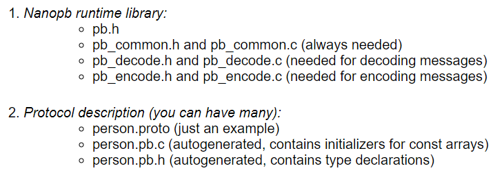
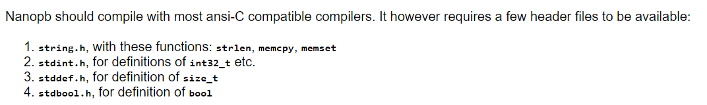

# PROTOBUF ON MICROCONTROLLER

## INTRODUCTION

- try to use protobuf on stm32f303

## HOW TO USE GUIDE

- install protoc
    - go to https://github.com/protocolbuffers/protobuf/releases to download the right binary version
    - follow the installation step in
- nanopb
    - run nanopb-setup.sh
    - after running `make install`, we will see the result as in nanopb-result.sh
        - it installs the module nanopb_pb2.py, plugin_pb2.py
    - need to modify nanopb_generator.py
        - `import pb.nanopb_pb2 as nanopb_pb2` as `import nanopb_pb2 as nanopb_pb2`
        - `import pb.plugin_pb2 as plugin_pb2` as `import plugin_pb2 as plugin_pb2`
- use nanopb
    - go to the folder nanopb/example/simple
    - `protoc -osimple.pb simple.proto`
    - `python nanopb/generator/nanopb_generator.py simple.pb`
    - it results in simple.pb.h and simple.pb.c
    - the embedded project requires
        - 
        - 
```bash
#nanopb-setup.sh
#compile and install nanopb
git clone https://github.com/nanopb/nanopb.git
cd nanopb
cmake .
make
sudo make install
```

```bash
#nanopb-result.sh
#RESULT OF make install
[ 16%] Built target generate_plugin_pb2.py
[ 33%] Built target generate_nanopb_pb2.py
[100%] Built target protobuf-nanopb-static
Install the project...
-- Install configuration: ""
-- Installing: /usr/local/lib/python2.7/dist-packages/nanopb_pb2.py
-- Installing: /usr/local/lib/python2.7/dist-packages/plugin_pb2.py
-- Installing: /usr/local/lib/libprotobuf-nanopb.a
-- Installing: /usr/local/lib/cmake/nanopb/nanopb-targets.cmake
-- Installing: /usr/local/lib/cmake/nanopb/nanopb-targets-noconfig.cmake
-- Installing: /usr/local/lib/cmake/nanopb/nanopb-config.cmake
-- Installing: /usr/local/lib/cmake/nanopb/nanopb-config-version.cmake
-- Installing: /usr/local/include/pb.h
-- Installing: /usr/local/include/pb_common.h
-- Installing: /usr/local/include/pb_encode.h
-- Installing: /usr/local/include/pb_decode.h
```

## REFERENCE

- https://github.com/protocolbuffers/protobuf
- https://bitbucket.org/lukych92/nanopb_serial_communication/src/master/
- https://github.com/PetteriAimonen/nanopb-benchmark
- http://vidieukhien.xyz/vi/2018/09/14/protocol-buffer-ung-dung-giao-tiep-truyen-nhan-data-part-1-gioi-thieu-va-build-file/
- https://blog.csdn.net/ykevin0510/article/details/45771645
